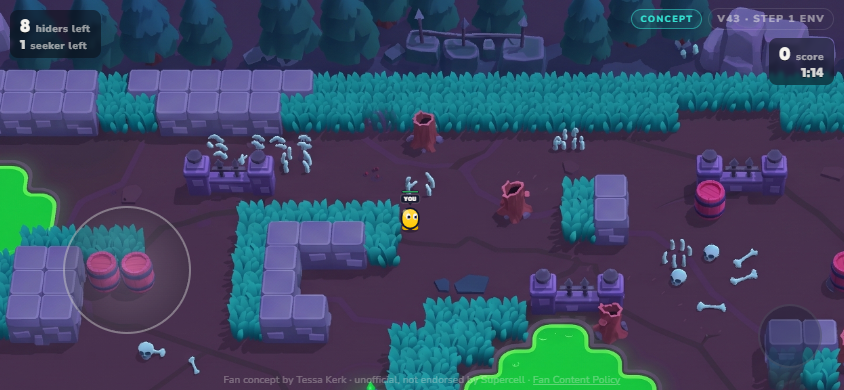
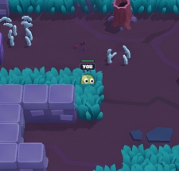
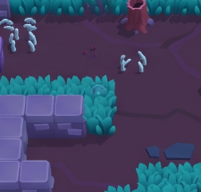

# Brawl & Seek

> A playable fan-concept hide-and-seek mode: paint into the arena, stay hidden, and survive the seekers.

[**Play it in your browser**](https://tessa-kerk.github.io/brawl-and-seek/)



## The loop

Move through Acid Lakes, then hold still on a valid surface to paint your brawler into its surroundings. Movement immediately breaks camouflage, so hiding means choosing the right cover and timing your reposition.

Seekers patrol the arena and fire Tags. Misses cost their health; a hit exposes a hider. The round rewards smart movement, not standing in one place forever.



Bushes are walkable cover: the local brawler becomes translucent while moving through foliage, the lower canopy stays in front, and holding still still uses the same paint-in camouflage verb.

## Map Maker

Map Maker is a live sandbox for testing surface-camouflage rules, repaint timing, and the resulting arena behavior without changing the public match.



## Playing on a phone

Open the game in **landscape**. Use the on-screen touch joystick or drag on the arena to move; keyboard controls use WASD or the arrow keys. Holding still paints camouflage in over about one second. Move again to break it.

## Current status

The approved v43 build includes the footage-grounded follow camera, 50 × 27 Acid Lakes environment, collision, hider/seeker/Tag round loop, Map Maker, responsive landscape controls, and localized bush interaction. It is an actively developed browser prototype.

## Run locally

This is plain HTML, CSS, and JavaScript—no build step.

```sh
python -m http.server 8000
```

Then open `http://127.0.0.1:8000/`.

## Project structure

- `src/` — rendering, movement, camera, round and interaction systems
- `data/` — arena grid and tuning constants
- `assets/` — approved runtime art, UI, fonts, and public screenshots
- `tools/` — independent browser regression checks

## Fan content disclaimer

This is an unofficial fan concept by Tessa Kerk. It is not affiliated with, endorsed by, or sponsored by Supercell. No Supercell code, art, or audio is included. Created in the spirit of Supercell’s Fan Content Policy.

---

Built by [Tessa Kerk](https://www.linkedin.com/in/tessakerk/) · [Portfolio](https://tessakerk.com) · [Play Brawl & Seek](https://tessa-kerk.github.io/brawl-and-seek/)
